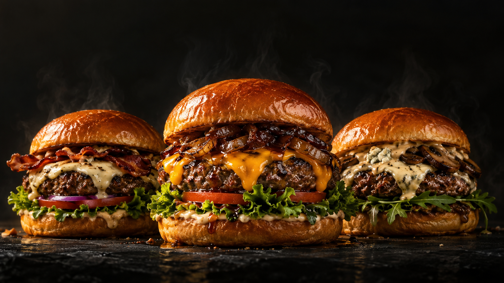

# 3 Monkeys Bozüyük

3 Monkey Burger House Bozüyük şubesi için hazırlanmış, Türkçe ve mobil uyumlu web sitesi konsepti.



## Deneyim

- Üç fotogerçekçi burger içeren sinematik ana ekran.
- Kaydırdıkça birleşen altı fotoğraf katmanı: üst ekmek, sos/eşlikçiler, cheddar, dana köftesi, yeşillik ve alt ekmek.
- CSS perspektifli **2.5D** sahne; WebGL modeli gerektirmez.
- Tam ekran responsive hero, mobil için ayrı dikey kompozisyon, marka renklerinde başlık ve gerçek zamanlı WebGL duman simülasyonu.
- Hero yazısında sıralı fade/pop girişi; bölüm başlıklarında, açıklamalarda ve menü kartlarında kaydırmayla tetiklenen girişler.
- Parallax ve hover animasyonları.
- Ayrı ana sayfa, menü, hikâyemiz ve iletişim sayfaları.
- Klavye ile kullanılabilen mobil navigasyon, Escape desteği, azaltılmış hareket tercihi.
- Gerçek telefon, Instagram, harita ve güncel menü bağlantıları.

## Çalıştırma

Node.js 22.13+ gerekir.

```sh
npm ci
npm run dev
```

Geliştirme adresi: http://localhost:5173

```sh
npm run typecheck
npm run build
npm start
```

`npm start` üretim çıktısını yerel Cloudflare Worker çalışma ortamında açar; konsolda yazılan adresi kullanın. Komut siteyi internete yayımlamaz.

## Teknoloji

React 19, TypeScript, Next.js App Router uyumlu Vinext/Vite, CSS animasyonları, bağımlılıksız WebGL shader ve Lucide ikonları. Fontlar yerel sunulur. Animasyonlar pasif scroll dinleyicisi ve requestAnimationFrame ile yürütülür. Duman 30 fps ile sınırlıdır; ekran dışındayken, sekme gizliyken veya azaltılmış hareket seçiliyken durur. WebGL desteklenmediğinde arayüz çalışmaya devam eder. Backend, ödeme, üyelik ve kişisel veri toplama akışı yoktur.

## Dosyalar

- `app/`: sayfalar, ortak düzen ve tasarım stilleri
- `components/burger-assembly.tsx`: katmanların kaydırmaya bağlı birleşmesi
- `components/hero.tsx`, `app/hero.css`: responsive hero ve marka tipografisi
- `components/hero-smoke.tsx`: gerçek zamanlı türbülanslı duman shader’ı
- `components/motion.tsx`, `app/motion.css`: bölüm/kart girişleri, hero yazı animasyonları ve parallax; JavaScript olmadan görünür içerik ve azaltılmış hareket desteği
- `components/smooth-scroll.tsx`: Lenis ile yumuşak tekerlek kaydırması; doğal dokunmatik kaydırma, sayfa içi bağlantılar, rota değişiminde temizlik ve canlı azaltılmış hareket tercihi desteği.
- `lib/restaurant.ts`: şube bağlantıları ve menü verileri
- `public/images/`: proje içinde tutulan tüm görseller
- `docs/ASSETS.md`: kaynaklar ve görsel kullanım kapsamı
- `docs/IMAGE-PROMPTS.md`: yerleşik Imagegen ile kullanılan üretim promptları

## İçerik kapsamı

Bu çalışma bağımsız bir web tasarım konseptidir; restoranın resmî sitesi olduğu iddia edilmez. Sahne görselleri temsilidir. Menü, erişilen şube menüsünden bir seçkidir. Fiyatlar ve doğrulanamayan çalışma saatleri gösterilmez; güncel bilgi için şubenin mevcut kanallarına yönlendirilir.

## Lisans

Özgün uygulama kodu [MIT](LICENSE) lisanslıdır. Marka, logo, kullanıcı tarafından sağlanan fotoğraflar, fontlar ve üçüncü taraf bileşenler kendi hak/lisans kapsamlarını korur; MIT lisansı bunlar için marka veya medya kullanım hakkı vermez. Ayrıntılar: [görsel ve kaynak notları](docs/ASSETS.md).
